# xMixing Database Diagram

> Auto-generated from `x02-BackEnd/x0201-fastAPI/models.py`
> Generated: 2026-03-07

```mermaid
erDiagram

    %% ══════════════════════════════════════════════
    %% Core Tables
    %% ══════════════════════════════════════════════

    users {
        int id PK
        varchar50 username UK "NOT NULL"
        varchar100 email UK "NOT NULL"
        varchar255 password_hash "NOT NULL"
        varchar100 full_name
        enum role "Admin | Manager | Operator | QC Inspector | Viewer"
        varchar100 department
        enum status "Active | Inactive"
        json permissions
        datetime last_login
        timestamp created_at
        timestamp updated_at
    }

    ingredients {
        int id PK
        varchar50 blind_code
        varchar50 mat_sap_code
        varchar50 re_code
        varchar50 ingredient_id "NOT NULL"
        varchar150 name "NOT NULL"
        varchar20 unit "default: kg"
        varchar50 Group
        float std_package_size "default: 25.0"
        varchar50 warehouse
        varchar50 package_container_type "default: Bag"
        varchar20 status "default: Active"
        varchar50 creat_by "NOT NULL"
        timestamp created_at
        varchar50 update_by
        timestamp updated_at
    }

    ingredient_intake_from {
        int id PK
        varchar100 name UK "NOT NULL"
        timestamp created_at
    }

    package_container_types {
        int id PK
        varchar50 name UK "NOT NULL"
        timestamp created_at
    }

    package_container_sizes {
        int id PK
        float size UK "NOT NULL"
        timestamp created_at
    }

    %% ══════════════════════════════════════════════
    %% Ingredient Intake
    %% ══════════════════════════════════════════════

    ingredient_intake_lists {
        int id PK
        varchar50 intake_lot_id "NOT NULL"
        varchar50 lot_id "NOT NULL"
        varchar50 intake_from
        varchar50 intake_to
        varchar50 blind_code
        varchar50 mat_sap_code "NOT NULL"
        varchar50 re_code
        varchar200 material_description
        varchar20 uom
        float intake_vol "NOT NULL"
        float remain_vol "NOT NULL"
        float intake_package_vol
        int package_intake
        datetime expire_date
        varchar20 status "default: Active"
        timestamp intake_at
        varchar50 intake_by "NOT NULL"
        varchar50 edit_by
        timestamp edit_at
        varchar50 po_number
        datetime manufacturing_date
        float batch_prepare_vol
        float std_package_size "default: 25.0"
        datetime ext_date
        varchar50 reserv_no
        varchar50 stock_zone
        varchar50 material_type
    }

    ingredient_intake_history {
        int id PK
        int intake_list_id FK "NOT NULL"
        varchar50 action "NOT NULL"
        varchar20 old_status
        varchar20 new_status
        varchar255 remarks
        varchar50 changed_by "NOT NULL"
        timestamp changed_at
    }

    intake_package_receive {
        int id PK
        int intake_list_id FK "NOT NULL"
        int package_no "NOT NULL"
        float weight "NOT NULL"
        timestamp created_at
        varchar50 created_by
    }

    %% ══════════════════════════════════════════════
    %% SKU / Recipe
    %% ══════════════════════════════════════════════

    sku_groups {
        int id PK
        varchar50 group_code UK "NOT NULL"
        varchar100 group_name "NOT NULL"
        varchar255 description
        varchar20 status "default: Active"
        timestamp created_at
        timestamp updated_at
    }

    sku_masters {
        int id PK
        varchar50 sku_id UK "NOT NULL"
        varchar200 sku_name "NOT NULL"
        float std_batch_size
        varchar20 uom
        varchar20 status "default: Active"
        int sku_group FK
        varchar50 creat_by "NOT NULL"
        varchar50 update_by
        timestamp created_at
        timestamp updated_at
    }

    sku_steps {
        int id PK
        varchar50 sku_id FK
        varchar20 phase_number
        varchar50 phase_id
        boolean master_step "default: false"
        int sub_step "NOT NULL"
        varchar100 action
        varchar50 re_code
        varchar50 action_code
        varchar100 setup_step
        varchar100 destination
        float require
        varchar20 uom
        float low_tol
        float high_tol
        varchar100 step_condition
        float agitator_rpm
        float high_shear_rpm
        float temperature
        float temp_low
        float temp_high
        int step_time
        int step_timer_control
        boolean qc_temp "default: false"
        boolean record_steam_pressure "default: false"
        boolean record_ctw "default: false"
        boolean operation_brix_record "default: false"
        boolean operation_ph_record "default: false"
        varchar50 brix_sp
        varchar50 ph_sp
        varchar200 action_description
        timestamp created_at
        timestamp updated_at
    }

    sku_actions {
        varchar50 action_code PK
        varchar200 action_description "NOT NULL"
        varchar255 component_filter
        timestamp created_at
        timestamp updated_at
    }

    sku_phases {
        int phase_id PK
        varchar50 phase_code
        varchar200 phase_description "NOT NULL"
        timestamp created_at
        timestamp updated_at
    }

    sku_destinations {
        int id PK
        varchar50 destination_code UK "NOT NULL"
        varchar200 description
    }

    %% ══════════════════════════════════════════════
    %% Production
    %% ══════════════════════════════════════════════

    production_plans {
        int id PK
        varchar50 plan_id UK "NOT NULL"
        varchar50 sku_id "NOT NULL"
        varchar200 sku_name
        varchar50 plant
        float total_volume
        float total_plan_volume
        float batch_size
        int num_batches
        date start_date
        date finish_date
        varchar20 status "default: Planned"
        boolean flavour_house "default: false"
        boolean spp "default: false"
        boolean batch_prepare "default: false"
        boolean ready_to_product "default: false"
        boolean production "default: false"
        boolean done "default: false"
        varchar50 created_by
        varchar50 updated_by
        timestamp created_at
        timestamp updated_at
    }

    production_plan_history {
        int id PK
        int plan_db_id FK "NOT NULL"
        varchar50 action "NOT NULL"
        varchar20 old_status
        varchar20 new_status
        varchar255 remarks
        varchar50 changed_by "NOT NULL"
        timestamp changed_at
    }

    production_batches {
        int id PK
        int plan_id FK "NOT NULL"
        varchar100 batch_id UK "NOT NULL"
        varchar50 sku_id "NOT NULL"
        varchar50 plant
        float batch_size
        varchar50 status "default: Created"
        boolean flavour_house "default: false"
        boolean spp "default: false"
        boolean batch_prepare "default: false"
        boolean ready_to_product "default: false"
        boolean production "default: false"
        boolean done "default: false"
        timestamp fh_boxed_at
        timestamp spp_boxed_at
        timestamp fh_delivered_at
        varchar50 fh_delivered_by
        timestamp spp_delivered_at
        varchar50 spp_delivered_by
        timestamp created_at
        timestamp updated_at
    }

    %% ══════════════════════════════════════════════
    %% PreBatch
    %% ══════════════════════════════════════════════

    prebatch_reqs {
        int id PK
        int batch_db_id FK "NOT NULL"
        varchar50 plan_id
        varchar100 batch_id
        varchar50 re_code
        varchar200 ingredient_name
        float required_volume
        varchar50 wh
        int status "0=Pending 1=InProgress 2=Completed"
        timestamp created_at
        timestamp updated_at
    }

    prebatch_recs {
        int id PK
        int req_id FK
        varchar100 batch_record_id UK "NOT NULL"
        varchar50 plan_id
        varchar50 re_code
        int package_no
        int total_packages
        float net_volume
        float total_volume
        float total_request_volume
        varchar50 intake_lot_id
        varchar50 mat_sap_code
        varchar100 prebatch_id
        varchar50 recode_batch_id
        int recheck_status "0=Pending 1=OK 2=Error"
        timestamp recheck_at
        varchar50 recheck_by
        int packing_status "0=Unpacked 1=Packed"
        timestamp packed_at
        varchar50 packed_by
        timestamp created_at
    }

    prebatch_rec_from {
        int id PK
        int prebatch_rec_id FK "NOT NULL"
        varchar50 intake_lot_id "NOT NULL"
        varchar50 mat_sap_code
        float take_volume "NOT NULL"
        timestamp created_at
    }

    %% ══════════════════════════════════════════════
    %% Reference Tables
    %% ══════════════════════════════════════════════

    plants {
        int id PK
        varchar50 plant_id UK "NOT NULL"
        varchar100 plant_name "NOT NULL"
        float plant_capacity "default: 0"
        varchar255 plant_description
        varchar20 status "default: Active"
        timestamp created_at
        timestamp updated_at
    }

    warehouses {
        int id PK
        varchar50 warehouse_id UK "NOT NULL"
        varchar100 name "NOT NULL"
        varchar255 description
        varchar20 status "default: Active"
        timestamp created_at
        timestamp updated_at
    }

    %% ══════════════════════════════════════════════
    %% Stock Adjustment
    %% ══════════════════════════════════════════════

    stock_adjustments {
        int id PK
        varchar50 intake_lot_id "NOT NULL"
        varchar50 mat_sap_code
        varchar50 re_code
        varchar200 material_description
        varchar20 adjust_type "NOT NULL (increase|decrease)"
        varchar50 adjust_reason "NOT NULL"
        float adjust_qty "NOT NULL"
        float prev_remain_vol "NOT NULL"
        float new_remain_vol "NOT NULL"
        varchar255 remark
        varchar50 adjusted_by "NOT NULL"
        timestamp adjusted_at
    }

    %% ══════════════════════════════════════════════
    %% Relationships
    %% ══════════════════════════════════════════════

    ingredient_intake_lists ||--o{ ingredient_intake_history : "has history"
    ingredient_intake_lists ||--o{ intake_package_receive : "has packages"

    sku_groups ||--o{ sku_masters : "groups"
    sku_masters ||--o{ sku_steps : "has steps"

    production_plans ||--o{ production_batches : "has batches"
    production_plans ||--o{ production_plan_history : "has history"

    production_batches ||--o{ prebatch_reqs : "has reqs"
    prebatch_reqs ||--o{ prebatch_recs : "has records"
    prebatch_recs ||--o{ prebatch_rec_from : "has origins"
```

## Table Summary

| # | Category | Table Name | Description |
|---|----------|------------|-------------|
| 1 | Core | `users` | System users with roles & permissions |
| 2 | Core | `ingredients` | Raw material master data |
| 3 | Core | `ingredient_intake_from` | Intake source locations |
| 4 | Core | `package_container_types` | Container type lookup |
| 5 | Core | `package_container_sizes` | Container size lookup |
| 6 | Intake | `ingredient_intake_lists` | Ingredient receiving records |
| 7 | Intake | `ingredient_intake_history` | Audit trail for intake changes |
| 8 | Intake | `intake_package_receive` | Per-package weight records |
| 9 | SKU | `sku_groups` | SKU classification groups |
| 10 | SKU | `sku_masters` | SKU / recipe master data |
| 11 | SKU | `sku_steps` | Recipe steps per SKU |
| 12 | SKU | `sku_actions` | Action code lookup |
| 13 | SKU | `sku_phases` | Phase lookup |
| 14 | SKU | `sku_destinations` | Destination lookup |
| 15 | Production | `production_plans` | Production planning |
| 16 | Production | `production_plan_history` | Audit trail for plan changes |
| 17 | Production | `production_batches` | Individual batch tracking |
| 18 | PreBatch | `prebatch_reqs` | Pre-batch material requirements |
| 19 | PreBatch | `prebatch_recs` | Pre-batch weigh records |
| 20 | PreBatch | `prebatch_rec_from` | Source lot traceability |
| 21 | Reference | `plants` | Manufacturing plant lookup |
| 22 | Reference | `warehouses` | Warehouse lookup |
| 23 | Stock | `stock_adjustments` | Stock adjustment audit log |

## Database Views (Read-Only)

| View Name | Description |
|-----------|-------------|
| `v_sku_master_detail` | SKU master with step counts & group info |
| `v_sku_step_detail` | SKU steps with lookups & computed fields |
| `v_sku_complete` | Denormalized SKU data for export/reporting |
