# xMixing System — Data Flow Diagrams

> Auto-generated from project source code  
> Generated: 2026-03-07

---

## 1. High-Level System Architecture

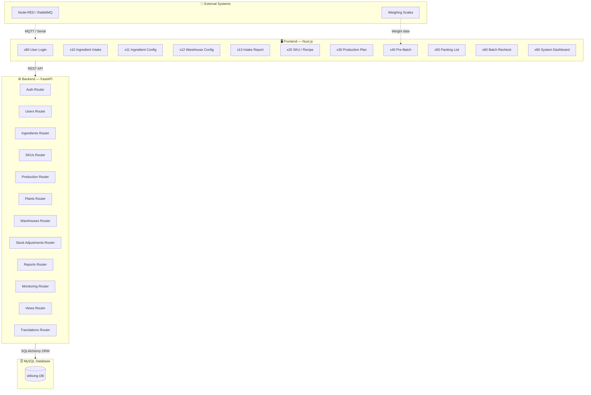

---

## 2. End-to-End Business Process Flow

```mermaid
flowchart LR
    subgraph Phase1["📦 Phase 1: Master Data Setup"]
        A1["Define Ingredients\n(Ingredient Config)"]
        A2["Define Warehouses\n(FH, SPP, MIX)"]
        A3["Define Plants\n(Production Lines)"]
        A4["Create SKU Recipes\n(Steps, Phases, Actions)"]
    end

    subgraph Phase2["📥 Phase 2: Ingredient Intake"]
        B1["Receive Raw Materials"]
        B2["Record Intake Lot\n(Lot ID, SAP Code, Volume)"]
        B3["Weigh Packages\n(Per-Package Weights)"]
        B4["Ingredient Stock\nAvailable"]
    end

    subgraph Phase3["📋 Phase 3: Production Planning"]
        C1["Create Production Plan\n(SKU, Volume, Dates)"]
        C2["Auto-Generate Batches\n(Plan ÷ Batch Size)"]
        C3["Auto-Generate PreBatch\nRequirements per Batch"]
    end

    subgraph Phase4["⚖️ Phase 4: Pre-Batch Weighing"]
        D1["Select Batch & Ingredient"]
        D2["Weigh on Scale\n(Net Volume per Bag)"]
        D3["Deduct from Inventory\n(Intake Lot Stock)"]
        D4["Record PreBatch Bag\n(Bag Barcode, Lot Origin)"]
        D5["Pack Bags into Box"]
    end

    subgraph Phase5["✅ Phase 5: Batch Re-Check"]
        E1["Scan Box Barcode"]
        E2["Scan Each Bag Barcode"]
        E3["Verify Weight vs Target\n(Check Tolerances)"]
        E4{"All Bags OK?"}
        E5["Release to Production"]
        E6["Flag Error Bags"]
    end

    subgraph Phase6["🚚 Phase 6: Delivery & Production"]
        F1["Close Box\n(FH or SPP boxed)"]
        F2["Deliver FH → SPP"]
        F3["Deliver SPP → Production Hall"]
        F4["Mixing Production"]
    end

    Phase1 --> Phase2
    Phase2 --> Phase3
    Phase3 --> Phase4
    Phase4 --> Phase5
    E4 -->|Yes| E5
    E4 -->|No| E6
    E5 --> Phase6
```

---

## 3. Ingredient Intake Data Flow

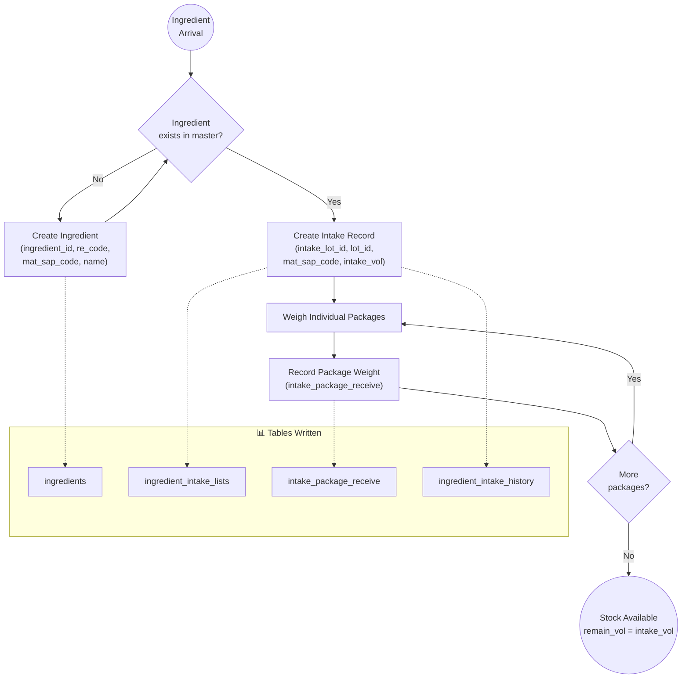

---

## 4. SKU / Recipe Management Data Flow

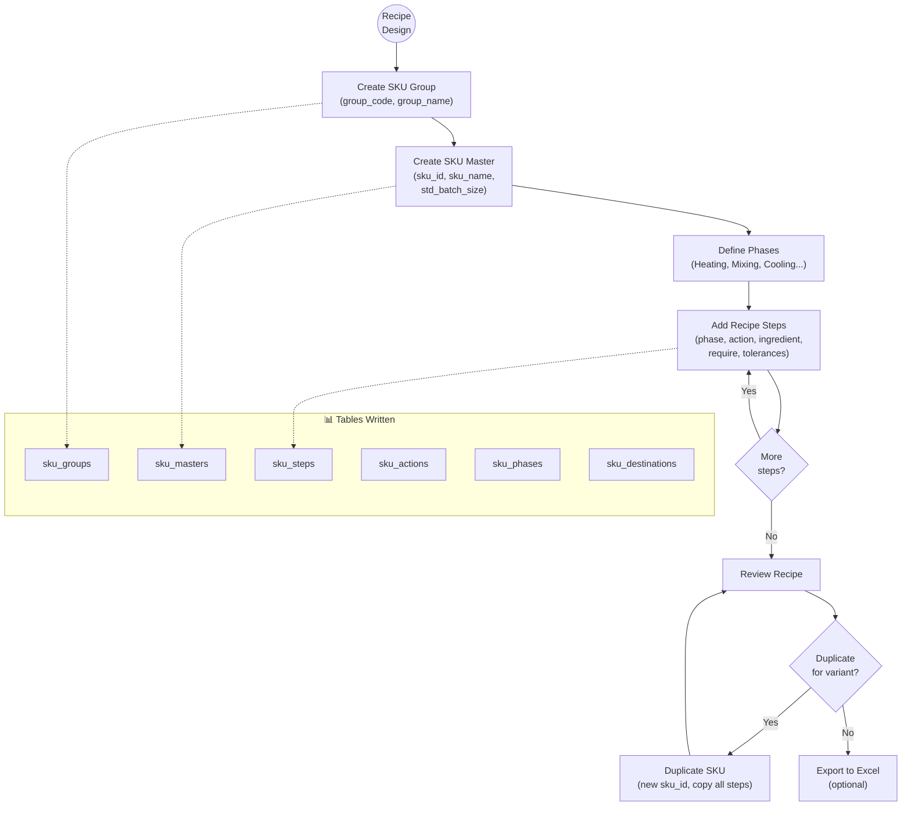

---

## 5. Production Planning Data Flow

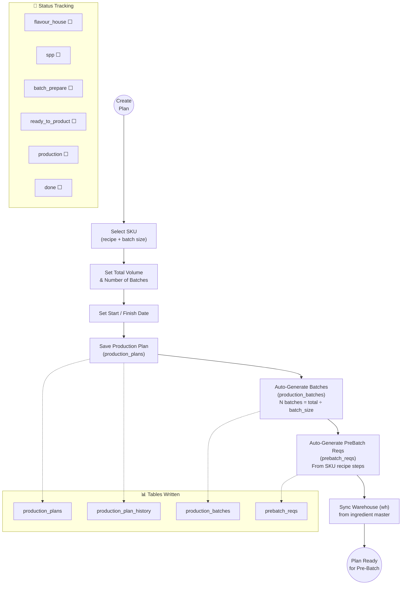

---

## 6. Pre-Batch Weighing Data Flow (Core Transaction)

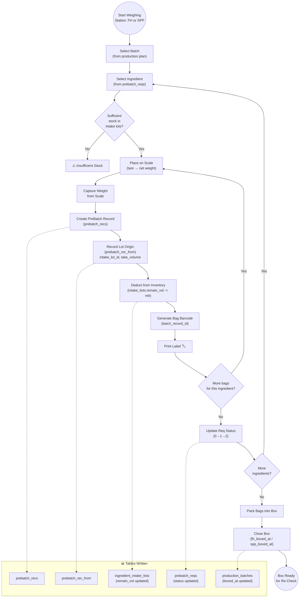

---

## 7. Batch Re-Check & Release Flow

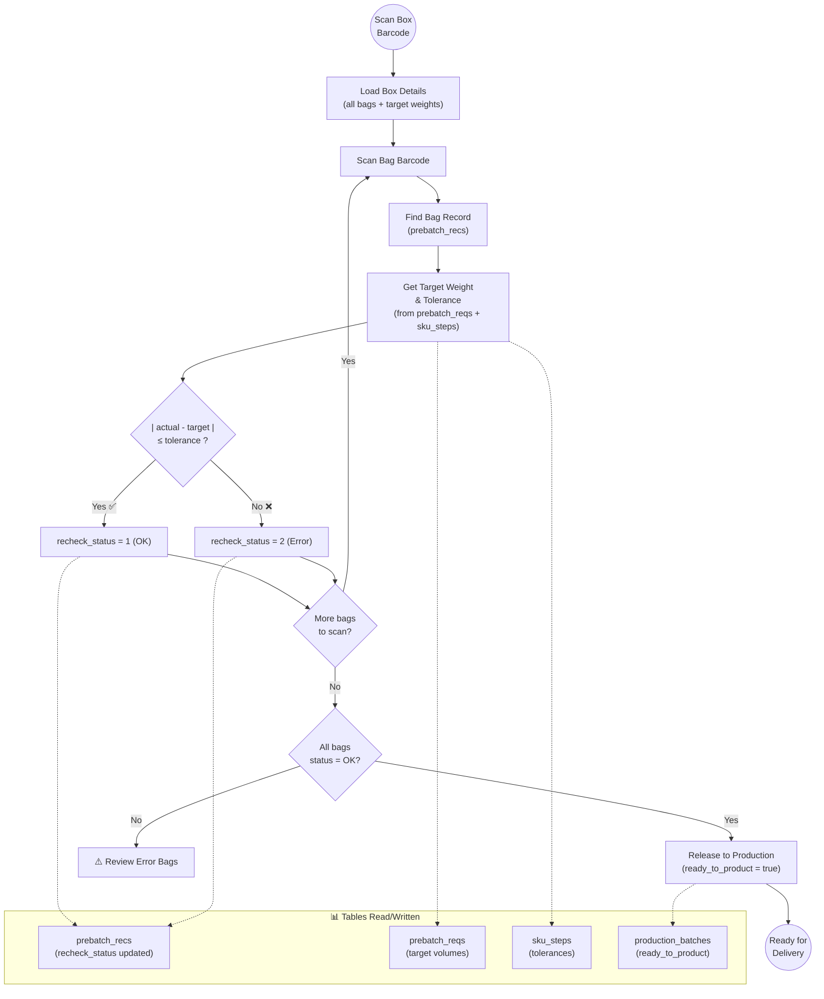

---

## 8. Delivery Flow

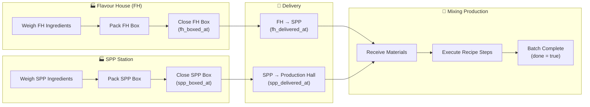

---

## 9. Stock Adjustment Data Flow

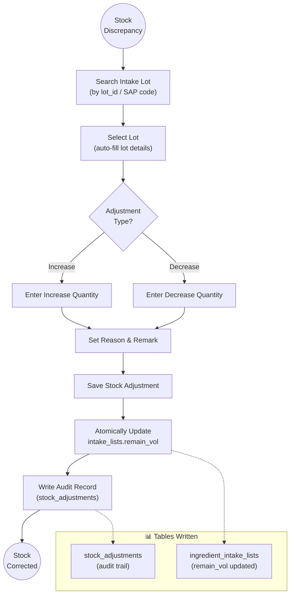

---

## 10. Reporting & Traceability Data Flow

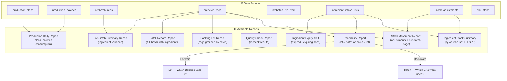

---

## 11. Complete System Data Flow (Summary)

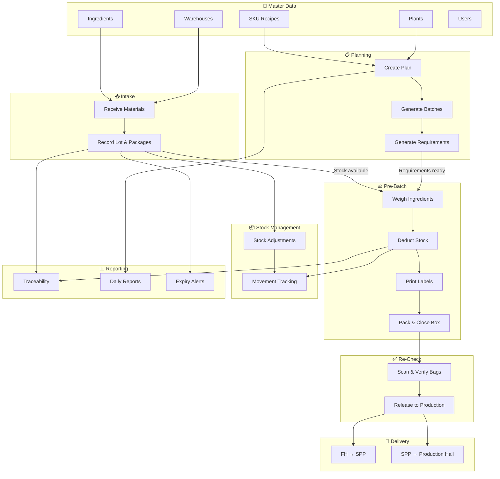
