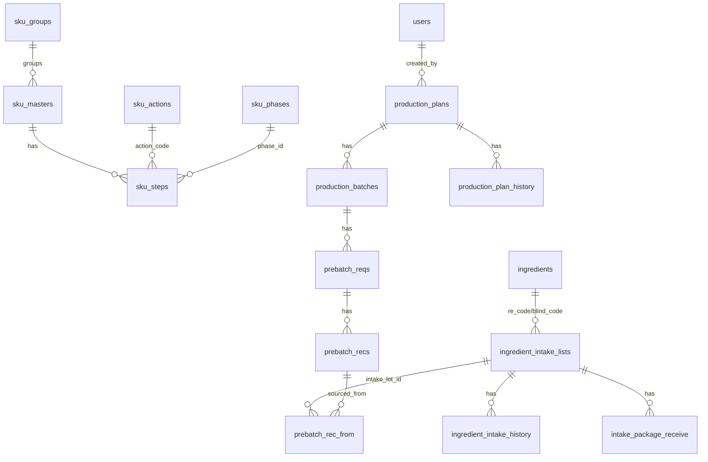
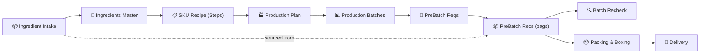

# xMixing Database Structure Analysis

**Database:** `xMixingControl` · **Engine:** MySQL/MariaDB · **Host:** `152.42.166.150:3306`
**ORM:** SQLAlchemy · **Source:** [models.py](file:///home/x-root/xApp/x01-local/x02-BackEnd/x0201-fastAPI/models.py)

---

## Entity-Relationship Diagram

---

## Tables by Domain

### 1. 👤 User Management

| Table | PK | Key Columns | Purpose |
|-------|:--:|-------------|---------|
| `users` | `id` | username, email, role (Enum), status, permissions (JSON) | User accounts with RBAC |

> **Roles:** Admin, Manager, Operator, QC Inspector, Viewer

---

### 2. 🧪 Ingredient Master

| Table | PK | Key Columns | Purpose |
|-------|:--:|-------------|---------|
| `ingredients` | `id` | blind_code, mat_sap_code, re_code, name, category, uom, std_package_size | Ingredient definitions |
| `ingredient_intake_from` | `id` | name | Lookup: where ingredients come from |
| `package_container_types` | `id` | name | Lookup: container types (bag, drum, etc.) |
| `package_container_sizes` | `id` | size (Float) | Lookup: standard container sizes |

---

### 3. 📦 Ingredient Intake (Warehouse Receiving)

| Table | PK | Key Columns | Purpose |
|-------|:--:|-------------|---------|
| `ingredient_intake_lists` | `id` | intake_lot_id, lot_id, mat_sap_code, re_code, intake_vol, remain_vol, status, po_number, stock_zone | Tracks each lot received into warehouse |
| `ingredient_intake_history` | `id` | intake_list_id → intake_lists, action, old/new_status, changed_by | Audit trail for intake status changes |
| `intake_package_receive` | `id` | intake_list_id → intake_lists, package_no, weight | Individual packages within a lot |

**Key Fields on `ingredient_intake_lists`:**
- `intake_lot_id` — unique lot identifier for scanning
- `remain_vol` — decremented as material is consumed by pre-batch
- `std_package_size` — default 25.0 kg
- `stock_zone` — warehouse location
- `expire_date`, `manufacturing_date`, `ext_date` — date tracking

---

### 4. 🏭 SKU / Recipe Management

| Table | PK | Key Columns | Purpose |
|-------|:--:|-------------|---------|
| `sku_groups` | `id` | group_code, group_name | Product family grouping |
| `sku_masters` | `id` | sku_id, sku_name, std_batch_size, sku_group → sku_groups | Product definitions |
| `sku_steps` | `id` | sku_id → sku_masters, phase_number, phase_id, sub_step, action, re_code, require, tolerances, process params | Recipe steps with detailed mixing instructions |
| `sku_actions` | `action_code` | action_description, component_filter | Action type lookup |
| `sku_phases` | `phase_id` | phase_code, phase_description | Phase type lookup |
| `sku_destinations` | `id` | destination_code, description | Where to send material |

**`sku_steps` Detail** — the most complex table:
- **Mixing params:** agitator_rpm, high_shear_rpm, temperature, temp range, step_time
- **Tolerances:** low_tol, high_tol on required volume
- **QC flags:** qc_temp, record_steam_pressure, record_ctw, operation_brix_record, operation_ph_record
- **Set points:** brix_sp, ph_sp

---

### 5. 📋 Production Planning

| Table | PK | Key Columns | Purpose |
|-------|:--:|-------------|---------|
| `production_plans` | `id` | plan_id, sku_id, sku_name, plant, total_volume, batch_size, num_batches, start/finish_date, status | Production plan header |
| `production_plan_history` | `id` | plan_db_id → plans, action, old/new_status | Audit trail |
| `production_batches` | `id` | plan_id → plans, batch_id, sku_id, plant, batch_size, status + 6 workflow flags | Individual batch within a plan |

**Workflow Flags on `production_batches`:**
| Flag | Meaning |
|------|---------|
| `flavour_house` | FH pre-batch ready |
| `spp` | SPP pre-batch ready |
| `batch_prepare` | Batch preparation done |
| `ready_to_product` | Ready for production line |
| `production` | Currently in production |
| `done` | Completed |

**Packing & Delivery Tracking (on `production_batches`):**
| Column | Purpose |
|--------|---------|
| `fh_boxed_at` | When FH packing box was sealed |
| `spp_boxed_at` | When SPP packing box was sealed |
| `fh_delivered_at` / `fh_delivered_by` | FH box delivered to SPP |
| `spp_delivered_at` / `spp_delivered_by` | SPP box delivered to production hall |

---

### 6. 🎯 Pre-Batch (Material Preparation)

| Table | PK | Key Columns | Purpose |
|-------|:--:|-------------|---------|
| `prebatch_reqs` | `id` | batch_db_id → batches, plan_id, batch_id, re_code, ingredient_name, required_volume, wh, status | What each batch needs |
| `prebatch_recs` | `id` | req_id → reqs, batch_record_id, plan_id, re_code, package_no, net_volume, intake_lot_id, packing_status, recheck_status | Each prepared bag/package |
| `prebatch_rec_from` | `id` | prebatch_rec_id → recs, intake_lot_id, mat_sap_code, take_volume | Traceability: which intake lot sourced each bag |

**`prebatch_reqs` Status:** 0 = Pending, 1 = In-Progress, 2 = Completed
**`prebatch_recs` Packing:** 0 = Unpacked, 1 = Packed
**`prebatch_recs` Recheck:** 0 = Pending, 1 = OK, 2 = Error

---

### 7. 🏢 Reference Tables

| Table | PK | Key Columns | Purpose |
|-------|:--:|-------------|---------|
| `plants` | `id` | plant_id, plant_name, location, status | Production plant/line definitions |
| `warehouses` | `id` | warehouse_id, name, description, status | Warehouse definitions |

---

## Database Views (Read-Only)

| View | Purpose | Key Fields |
|------|---------|------------|
| `v_sku_master_detail` | SKU master with step counts | All SKU fields + total_phases, total_sub_steps, group info |
| `v_sku_step_detail` | Steps with lookups & computed fields | All step fields + ingredient details, action/destination descriptions, step_label |
| `v_sku_complete` | Denormalized SKU data for export | Flat join of SKU + all step detail for reporting |

---

## Data Flow Summary

## Table Count Summary

| Domain | Tables | Views |
|--------|:------:|:-----:|
| User Management | 1 | — |
| Ingredient Master | 4 | — |
| Ingredient Intake | 3 | — |
| SKU / Recipe | 5 | 3 |
| Production | 3 | — |
| Pre-Batch | 3 | — |
| Reference | 2 | — |
| **Total** | **21** | **3** |
