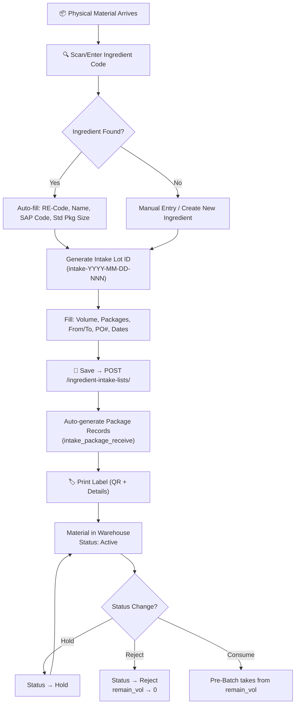

# Intake Process — Code & Database Analysis

**Module:** Ingredient Intake (Warehouse Receiving)
**Generated:** 2026-03-05

---

## Process Flow



---

## Database Tables (3 tables)

### `ingredient_intake_lists` — Main Record
| Column | Type | Key | Description |
|--------|------|:---:|-------------|
| id | INT | PK | Auto-increment |
| intake_lot_id | VARCHAR(50) | IDX | `intake-YYYY-MM-DD-NNN` |
| lot_id | VARCHAR(50) | | Supplier lot number |
| intake_from | VARCHAR(50) | | Source location |
| intake_to | VARCHAR(50) | | Destination warehouse |
| blind_code | VARCHAR(50) | IDX | Internal blind code |
| mat_sap_code | VARCHAR(50) | IDX | SAP material code |
| re_code | VARCHAR(50) | | Recipe code |
| material_description | VARCHAR(200) | | Material name |
| uom | VARCHAR(20) | | Unit of measure |
| intake_vol | FLOAT | | Total volume received |
| remain_vol | FLOAT | | Remaining volume (decremented by pre-batch) |
| intake_package_vol | FLOAT | | Volume per package |
| package_intake | INT | | Number of packages |
| std_package_size | FLOAT | | Default 25.0 kg |
| expire_date | DATETIME | | Expiry date |
| manufacturing_date | DATETIME | | Mfg date |
| ext_date | DATETIME | | Extended date |
| po_number | VARCHAR(50) | | Purchase order |
| reserv_no | VARCHAR(50) | | Reservation number |
| stock_zone | VARCHAR(50) | | Warehouse zone |
| material_type | VARCHAR(50) | | Material classification |
| batch_prepare_vol | FLOAT | | Volume allocated to batches |
| status | VARCHAR(20) | | Active / Hold / Reject |
| intake_at | TIMESTAMP | | When received |
| intake_by | VARCHAR(50) | | Who received |

### `ingredient_intake_history` — Audit Trail
| Column | Type | Key | Description |
|--------|------|:---:|-------------|
| id | INT | PK | |
| intake_list_id | INT | FK → intake_lists | |
| action | VARCHAR(50) | | Status change, edit, etc. |
| old_status / new_status | VARCHAR(20) | | Before/after |
| remarks | VARCHAR(255) | | Notes |
| changed_by | VARCHAR(50) | | Who changed |
| changed_at | TIMESTAMP | | When |

### `intake_package_receive` — Individual Packages
| Column | Type | Key | Description |
|--------|------|:---:|-------------|
| id | INT | PK | |
| intake_list_id | INT | FK → intake_lists | |
| package_no | INT | | Package sequence |
| weight | FLOAT | | Package weight |
| created_by | VARCHAR(50) | | |

---

## API Endpoints (Backend)

| Method | Path | Function |
|--------|------|----------|
| GET | `/ingredient-intake-lists/` | List all (paginated) |
| GET | `/ingredient-intake-lists/next-id` | Auto-generate next ID |
| GET | `/ingredient-intake-lists/{id}` | Get by ID |
| POST | `/ingredient-intake-lists/` | Create + auto-gen packages |
| PUT | `/ingredient-intake-lists/{id}` | Update record |
| DELETE | `/ingredient-intake-lists/{id}` | Delete record |
| GET | `/ingredients/` | List all (filter by SAP/lookup) |
| GET | `/ingredients/{id}` | Get by ID |
| POST | `/ingredients/` | Create |
| PUT | `/ingredients/{id}` | Update |
| DELETE | `/ingredients/{id}` | Delete |
| GET/POST/PUT/DELETE | `/ingredient-intake-from/` | Intake source CRUD |
| GET/POST/PUT/DELETE | `/package-container-types/` | Container types CRUD |
| GET/POST/PUT/DELETE | `/package-container-sizes/` | Container sizes CRUD |

---

## Code Map

### Backend
| File | Lines | Purpose |
|------|:-----:|---------|
| `routers/router_ingredients.py` | 338 | API endpoint definitions (29 routes) |
| `crud/crud_ingredient.py` | 316 | Database operations (30 functions) |
| `models.py` (lines 90-146) | 56 | ORM models for 3 intake tables |
| `schemas.py` | — | Pydantic validation schemas |

### Frontend
| File | Lines | Purpose |
|------|:-----:|---------|
| `x10-IngredientIntake.vue` | 2042 | Main intake page (form + table + features) |
| `x13-IngredientIntakeReport.vue` | — | Intake reporting page |

### Label Templates
| File | Format | Purpose |
|------|--------|---------|
| `ingredient_intake-label.svg` | Standard | Default intake label |
| `ingredient_intake-label_4x3.svg` | 4×3 in | Compact intake label |
| `ingredient_intake-label_4x3-r01.svg` | 4×3 in | Revised version |
| `ingredient_intake_label_100x060-001.svg` | 100×60mm | Small format label |

---

## Frontend Functions (x10-IngredientIntake.vue)

| Category | Functions | Description |
|----------|-----------|-------------|
| **Scanner** | `onScannerEnter`, `focusScannerInput` | Barcode scanner (keyboard emulator) |
| **Lookup** | `lookupIngredient`, `fetchAllIngredients`, `filterIngredients` | Ingredient search & autocomplete |
| **ID Gen** | `generateIntakeLotId` | `intake-YYYY-MM-DD-NNN` format |
| **CRUD** | `onSave`, `onEdit`, `onClear`, `onRejectIntake` | Create/Update/Clear/Reject |
| **Status** | `updateRecordStatus`, `getStatusColor` | Status management (Active/Hold/Reject) |
| **Data** | `fetchReceipts`, `fetchIntakeFromOptions`, `fetchIntakeToOptions` | API data fetching |
| **Print** | `printLabel`, `printSinglePackageLabel` | QR-based label printing |
| **Export** | `exportTable`, `importTable`, `onFileSelected` | CSV import/export |
| **Config** | `addIntakeFrom`, `deleteIntakeFrom`, `addWarehouse`, `deleteWarehouse` | Manage lookup options |
| **UI** | `openDetailDialog`, `filteredRows`, `columns`, `resetFilters` | Table, filtering, detail view |

---

## Key Logic: `create_ingredient_intake_list` (Backend)

```
1. Validate intake data
2. Create IngredientIntakeList record (remain_vol = intake_vol)
3. Auto-generate IntakePackageReceive records:
   - If package_intake > 0 and intake_package_vol > 0:
     - Create N-1 packages of intake_package_vol weight
     - Last package = remaining volume (handles rounding)
4. Create IngredientIntakeHistory entry (action="Created")
5. Return created record with packages relationship loaded
```

## Key Logic: `onSave` (Frontend)

```
1. Validate required fields (ingredientId, volume, from, to)
2. If editing → PUT /ingredient-intake-lists/{id}
3. If new → POST /ingredient-intake-lists/
4. On success:
   - Refresh table
   - Generate new intake lot ID
   - Clear form
   - Auto-print label (optional)
5. Auto-refresh table every 5 seconds
```
