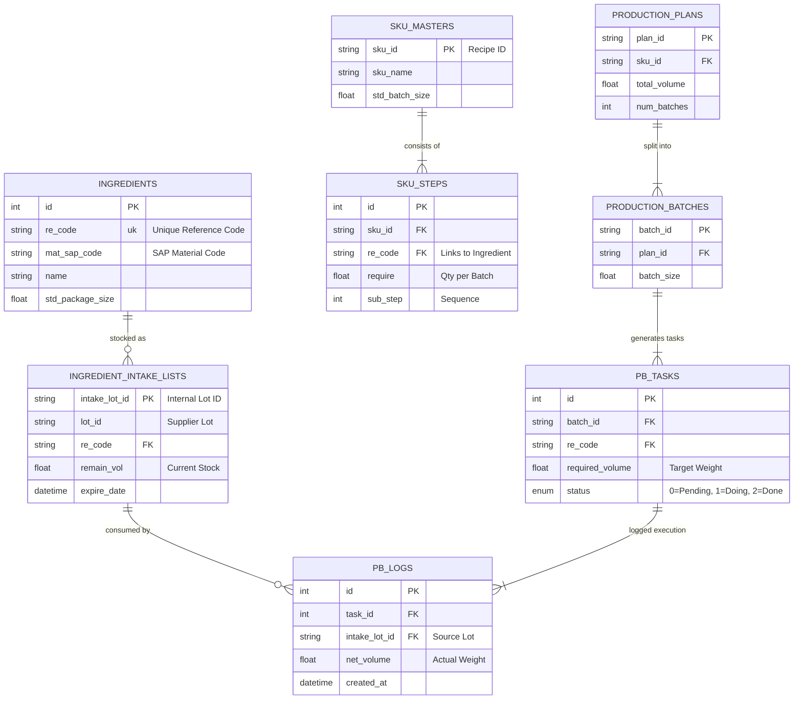

# Database Relationships & Schema Documentation

Results from the analysis of `models.py`.

## Entity-Relationship Diagram (Mermaid)

## Key Relationship Flows

### 1. The "Recipe" Flow (Master Data)
*   **SKU Master** (`SKU_MASTERS`) defines the header of a product (e.g., "Syrup Type A").
*   It has multiple **SKU Steps** (`SKU_STEPS`).
*   Each step referencing an ingredient links via `re_code` (Reference Code) to the **Ingredient** table. This is a soft link in some systems but critical for looking up names and standard package sizes.

### 2. The "Stock" Flow (Inventory)
*   Raw materials enter via **Ingredient Intake** (`INGREDIENT_INTAKE_LISTS`).
*   Key Traceability Field: `intake_lot_id`. This ID is printed on the QR label of the raw material bag.
*   **Relationship**: When a pre-batch action is performed, the system records which `intake_lot_id` was used in `PB_LOGS`.

### 3. The "Work Order" Flow (Planning)
*   A **Production Plan** (`PRODUCTION_PLANS`) requests a total volume (e.g., 1000kg).
*   This is divided into **Production Batches** (`PRODUCTION_BATCHES`) based on the `std_batch_size` vs `batch_size`.
    *   *Example*: 1000kg Plan / 500kg Batch Size = 2 Batches.
*   The system (via the new logic) generates **PB Tasks** (`PB_TASKS`) for each batch.
    *   One Task per Ingredient per Batch.

### 4. The "Execution" Flow (Traceability)
*   **PB Task** tells the operator: "Weigh 25kg of Sugar for Batch 001".
*   **PB Log** records the result: "Operator weighed 25.05kg of Sugar using Lot #L-299 at 10:05 AM".
*   **Traceability Chain**:
    `Plan` -> `Batch` -> `Task` -> `Log` -> `Intake Lot` -> `Supplier Lot`.

## Structural Integrity Notes
*   **Foreign Keys**: Explicit foreign keys exist between Plans and Batches.
*   **Soft Keys**: Links between Recipe Steps (`re_code`) and Ingredients are often "soft" (string matching) to allow flexibility, but data consistency must be maintained by the application layer.
